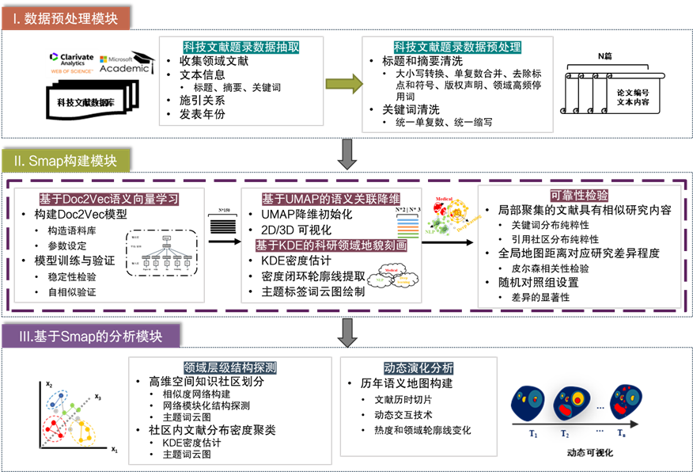
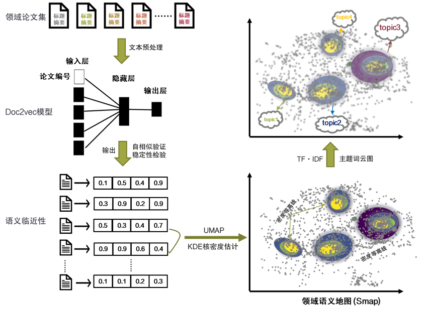

# Smap
 该方法实现了对领域知识地貌的刻画，提供了知识距离的连续性表征，为科学活动建模提供了出了知识网络之外的可选择的建模工具。We provide a method for constructing a semantic map (Smap).

 
 该分析框架包含四部分，科技文献预处理模块、Smap构建模块、层级结构探测和动态演化分析模块。
（1）	在获得科技文献的题录数据后，提取标题和摘要并对其进行预处理。
（2）	然后，选用Doc2Vec算法训练文献语料集，获得领域内每篇论文的语义向量。接着，运用UMAP算法对高维语义数值向量进行非线性降维，结合核密度估计（KDE）统计手段，以等高线刻画领域结构。最后，采用KeyBERT算法依据语义相似性提取每篇文献的关键词，利用TF-IDF算法调整权重关键词权重，进而绘制出词云图用以标注语义地图。根据地图上热度和主题距离分布，不仅可以概览领域的整体结构和各研究主题间的知识距离。构建过程如图2所示
（3）	通过高低维多次聚类捕获领域的层级结构。首先对高维语义空间进行基于语义距离的社区结构划分，然后将获得的知识社区在低维空间中再次进行基于密度的聚类。
（4）	结合交互技术绘制动态的历年领域地图，进一步可以展现领域发展态势和演化过程。累积地图有助于观察领域的形成和涌现，而切片地图有助于观察研究重心转移过程。

